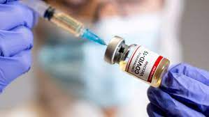

# Módulo 3 - CSS.

Durante el transcuro de convertirse en un Full Stack Developer, se ha cursado por "Módulo: Diseño y Estructura de ideas", "Módulo 2: HTML", y el "Módulo 3: CSS" en donde al final del contenido se realiza la siguiente práctica que es una página de vacunacion, apartir de un diseño previo realizarla lo más acercado posible

## ! VACUNATE ¡
## SI TODOS NOS VACUNAMOS CORREMOS MENOS RIESGO.
Es importante que te apliques tu o tus dosis correpondientes, que no se te pasen las fechas.Hazlo por ti, por tu familia y por todos.
Si necesitas mas información puedes visitar esta [página](./index.html)

#